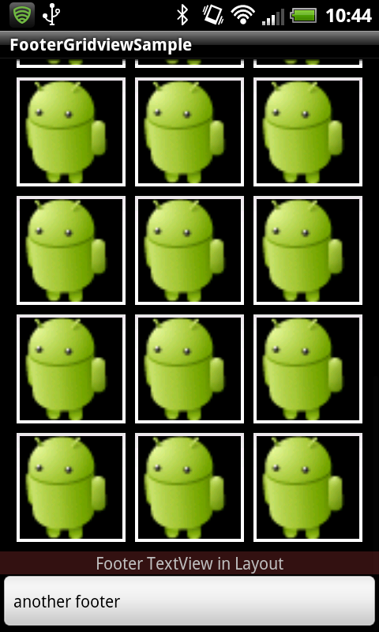

FooterGridViewSpecial
=====================
This project aims to provide a reusable GridView widget which can add a footer for Android. It is originally based on a part of AOSP gallery app.

Features
--------
* Flexible cell size
* Footer-View addable

Repository at [https://github.com/nagoya0/FooterGridViewSpecial](https://github.com/nagoya0/FooterGridViewSpecial)

Usage
-----
stub.

License
-------
Copyright &copy; 2012 Nagoya0

Licensed under the [Apache License, Version 2.0](http://www.apache.org/licenses/LICENSE-2.0)
